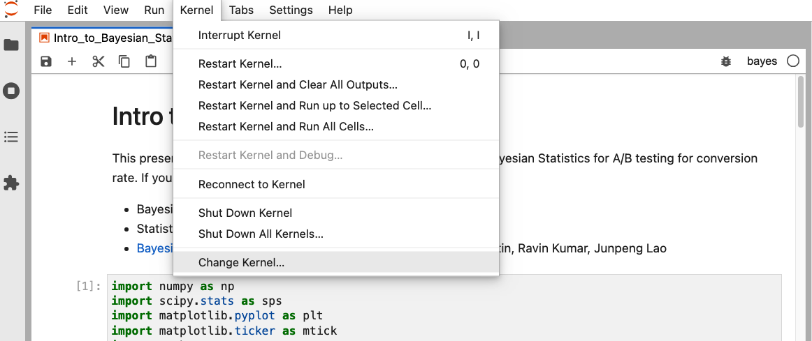
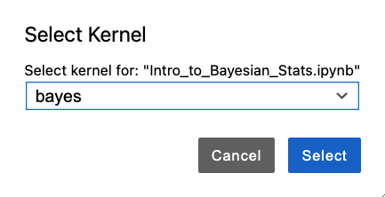

# An Introduction to Bayesian Statistics

This is an introduction on how to use Bayesian Statistics to run a binary outcome A/B test. The notebook **Intro_to_Bayesian_Stats.ipynb** uses PyMC4 for generating samples and probability.  Included in this notebook is some of the most commonly used visualizations for an A/B test.


## Setup

### 1. Create virtual environment
Once the material is on your computer, you'll see that the repository for this course has a file called `environment.yml` that includes a list of all the packages you need
to install. If you run:

```bash
conda env create -f environment.yml
```

This will create a new conda environment called **bayes**.

```bash
conda activate bayes
```

### 2. Setup and launch Jupyter

Next, make Jupyter aware of this new virtual environment. With the `bayes` environment activated, run:

```bash
python -m ipykernel install --user --name bayes
```

That will create what's called a *kernel* in Jupyter linguo (this is just a mirror of your virtual environment).
Then, you can start Jupyter Lab or Notebook to access the materials:

```bash
jupyter lab
```

**When you open any notebook, make sure it's using the right kernel, which will be named `bayes`**. You can check this at the top-right of the Jupyter page.  Select **`bayes`** if you're in another python kernel.

&nbsp;

**Figure 1: Kernel Selection in Jupyter Notebook**


Note: The presentation mode for **RISE** is only available in Jupyter Notebook and not in Jupyter Lab.

&nbsp;

**Figure 2: Kernel Selection in Jupyter Lab**


&nbsp;

Your setup is done.  You can start sampling!

## References & Thanks

Many of the techniques and code came from the Causal Inference Book Club, https://ravinkumar.com/BookClub2022.html and https://github.com/canyon289/causal_inf_bookclub

Thanks to Ravin Kumar for his enthusiastic attitude towards causual inferencing.  Check out his book with his co-authors: https://bayesiancomputationbook.com/welcome.html 

And, one of many text books that inspired me is here: https://mixtape.scunning.com/ and https://github.com/scunning1975/mixtape